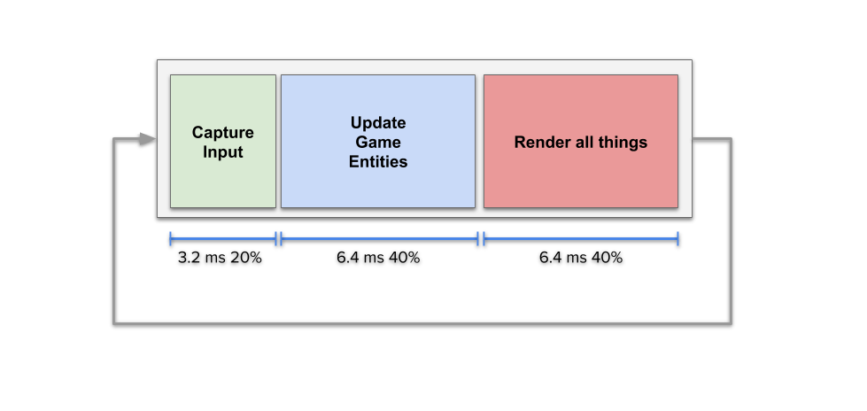
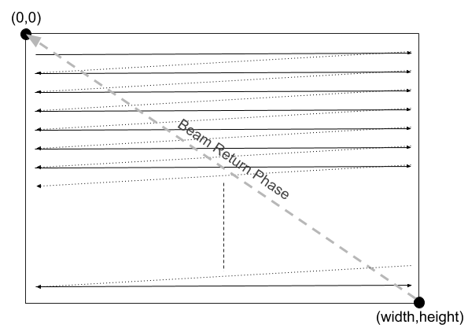
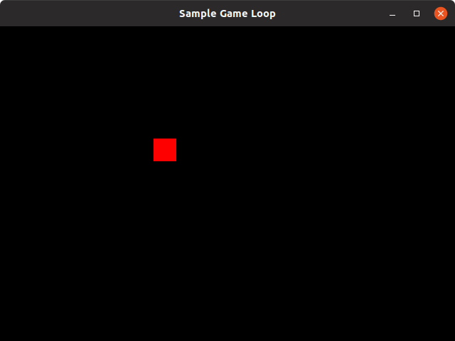
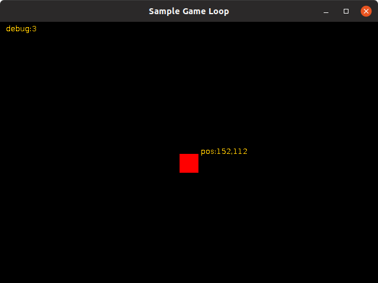

# The Game class

The Game is the entry point of our game. The main class is a frmework for all the game processing, from create window to animate all those beautiful sprites. Let's dive into this thing ! 

## ABC Loop !

The core routine of a game is a loop. 

### Why the loop ?

This main loop will achieve multiple goals. 

1. **capture the control input** from the player, which keys are pressed, which are released, where is the mouse cursor, all those input will be useful to animate or move all the characters in that game. 

2. The first one consists in **updating all the entities** managed by the game, a player character, an enemy, a small item to be collected, all those little people need to be maintain and updated according to internal and player actions.

3. **draw the graphical parts** of the game. The updated items must be (or not, depending on their visibility) displayed on screen, and animated according to some rules.

And finally, restart at point 1, until the game end of the player clearly request to exit from the game.



The times displayed are standard ones, measured through numerous old games, and is a basic time stepping for capture, update and render  a game for a frame of 15 ms at 50 Frame Per Second.

> **Note** 
> At 60 FPS, the frame is 16 ms.

This Loop can be written as this synthetic algorithm :

```java
while(!exit){
  input();
  update(time);
  render();
} 
```

### A little History

But why does games' loop look like this ?

 to translate

The way the game a processed has been directed many years ago, when display screenwhere CRT ones, and a beam was used to swept the screen surface to create pixels.

CPU were very slow and each CPU cycle were counting. No multi threading available, so the cost of displaying pixel was the most time consumer. 

So the beam is sweeping the screen from top left(position 0,0) to bottom right (525,320). So during the beam return from bottom right (position 525,320) to top left ( position 0,0), the CPU was used to compute all other things in the game than display. And this was happening ever 1/25 s, because 25 images where displayed per second, according to AC power frequency (yes, all were linked).



So at least, the CPU time was split into 2 main phases, 

- capturing input and updating things during beam return, 
- and then, display all game's things.

Now, those operation are all managed through powerful hardware, specifically for displaying, helped by GPU, and we split all phases with this specific sort order:

1. Capture Input,
2. Update game objects,
3. Render and display game objects.

So let's have a tour on some beginner code.

### Looping in code

We won't lay too much on the initialization things around `JFrame` and so on, Let's focus on the Loop itself.

In a well formed Java class, the `samples.SampleGameLoop` sample code will explain more than words:


```java
public class SampleGameLoop {
  private boolean exit = false;
  private long FPS = 60;
  
  public SampleGameLoop(String title, int w,int h, int s){
    ...
  }
  
  public void initialize(){...}
  
  public void run(){
    initialize();
    loop();
  }

  public loop(){
    long elapsed=0;
    long startTime=System.currentMillis();
    long lastTime=startTime;
    while(!exit){
      startTime = System.currentMillis();
      input();
      update(elapsed);
      render();        
      elapsed = startTime - lastTime;
      waitFrame(elapsed);
      lastTime = startTime;
    }
  }
  private void input(){...}
  private void update(long elapsed){...}
  private void render(){...}
  
  private void waitFrame(long e){...}
    
  public static void main(String[] argc){
    SampleGameLoop dm = new SampleGameLoop("Sample Game Loop",320,200,2);
    rm.run();
  }
}
```

As explain just before, the structure of this class is a basic for any game you would like to create.

But for some modern and pragmatic reason, you will notice a `waitFrame(long)` method, to manage the frequency of `update(elapsed)` method. Yes, GPU/CPU are now so speeeeedy that we need to break a little bit.

")

So the good loop consists in: first initialize things, then start looping by getting keys from keyboard, processing game objects, then rendering those objects, and finally waiting some milliseconds. 

With such simple class we will incrementally, step by step, instruction per instruction, create our platform game.

### Some Sample code

#### Bouncy Square

In a very simple game loop implementation, you can easily animate a bouncing square. A red square will move from side to side on the screen, bumping on borders, and changing its own direction according to the border detected collision.

#### Code !

Let's explore the way JFrame window is used to create

```java
public class SampleGameLoop{
    JFrame frame;
    BufferedImage screenBuffer;
    
    int x=0; 
    int y=0;
    int dx=2; 
    int dy=2;
    Color color=Color.RED;
    ...
    
    public void update(int elapsed){
        x+=dx;
        y+=dx;
        if(x>screenBuffer.getWidth()){ x=screenBuffer.getWidth();dx=-dx;}
        if(y>screenBuffer.getHeight()){ x=screenBuffer.getHeight();dy=-dy;}
        if(x<0){ x=0;dx=-dx;}
        if(y<0){ y=0;dy=-dy;}
    }
    
    public void render(){
        Graphics2D g = (Graphics2D)screenBuiffer.getGraphics();
        g.setColor(Color.BLACK);
        g.fillRect(0,0,screenBuffer.getWidth(),screenBuffer.getHeight());
        
        g.setColor(color);
        g.fillRect(x,y,16,16);

        // render to screen
        Graphics2D sg = (Graphics2D) frame.getContentPane().getGraphics();
        sg.drawImage(screenBuffer, 
                     0, 0, 
                     screenBuffer.getWidth() * scale, 
                     screenBuffer.getHeight() * scale, 
                     0, 0,
                	 screenBuffer.getWidth(), 
                     screenBuffer.getHeight(), 
                     null);
		// ... debug info ...
    }
}
```

#### Adding user interactivity

As we are all player, let's add some interactivity by detecting some directional keys. The `UP`, `DOWN`, `LEFT`, and `RIGHT` keys will change speed value on each main axes, vertical and horizontal. 

But a maximum limit value for that speed will be checked, the `maxD` set by default at 4. 

So add the `KeyListener` interface, to capture input keys, to our `SampleGameLoop` class and implements missing methods. the one interesting us is the `keyReleased` one.

This will be updated on each `keyReleased()` event.

```java
public class SampleGameLoop implements KeyListener{
    int maxD = 4;
    ...
    public void keyPressed(KeyEvent e){
        // Nothing here
    }
    public void keyReleased(KeyEvent e){
        switch(e.getCode()){
            case VK_UP:
                dy=(dy<maxD?dy+1:dy);
                break;
            case VK_DOWN:
                dy=(dx>=-maxD?dy-1:dy);
                break;
            case VK_LEFT:
                dy=(dx>=-maxD?dy-1:dy);
                break;
            case VK_RIGHT:
                dy=(dy<maxD?dy+1:dy);
                break;
            //... other case ...
            default:
                break;
        }
    }
    public void keyInput(KeyEvent e){
        // Nothing here
    }
    ...
}
```

you can play this `SampleGameLoop.java` from the `src/test/samples` path by executing:

```bash
$> cd src/main/java/samples/
$> javac SampleGameLoop.java
$> java SampleGameLoop
```

you will certainly get window like this :



If you press 3 times the `D` key, some debugging information will be displayed. the debug value will cycle from 0 to 5 max.

